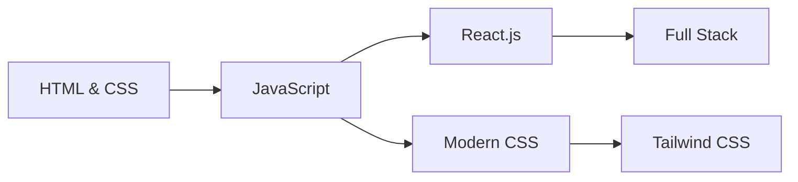

<div align="center">

# 👋 Hey there, I'm Zohia


<p>
  
  
  
</p>

</div>

---

## 🎯 About Me

```javascript
const developer = {
    name: "Zohia",
    location: "Karachi, Pakistan 🇵🇰",
    role: "Web Developer",
    currentlyLearning: ["JavaScript", "React", "Modern CSS"],
    interests: ["Coding", "UI/UX", "Problem Solving"],
    dailyHabit: "Solving coding challenges ☕"
};
```


- 🔨 Working on **Modern Web Applications**
- 📚 Learning **JavaScript & React.js**
- 🎨 Interested in **Frontend Development & UI/UX**
- 🤝 Open to **Collaborating on Web Projects**
- 💡 Ask me about **HTML, CSS, JavaScript**
- 📧 Contact: **zohia758@gmail.com**
- ⚡ Fun fact: **I collect coding challenges daily!**

<br clear="right"/>

---

## 🚀 Tech Stack

<div align="center">

### 💻 Languages


### 🎨 Frontend Development


### 🛠️ Tools & Platforms


</div>

---

## 📈 GitHub Stats

<div align="center">
  


</div>

<div align="center">
  
</div>

<div align="center">
  
</div>

---

## 📚 Learning Path

<div align="center">



</div>

**Current Focus:**
- ✅ JavaScript Fundamentals
- 🔄 DOM Manipulation & Events
- 🔄 ES6+ Features
- 📝 React.js Basics
- 📝 Responsive Web Design

---

## 🤝 Let's Connect

<div align="center">

[](https://linkedin.com/in/zohia-afaq)
[](https://twitter.com/zohia695574)
[](mailto:zohia758@gmail.com)

</div>

---

<div align="center">

### 💭 Dev Quote


### ⭐ Show some love by starring repositories you find interesting!


</div>
